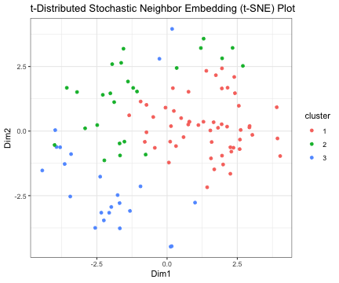
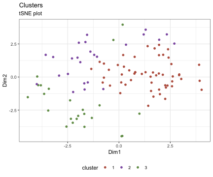
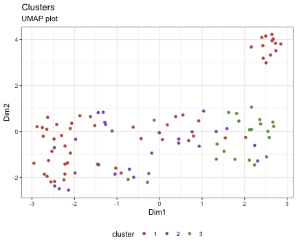

## 1. Introduction
The `ascend` R package provides simple, robust tools for the processing and 
exploration of data generated by single cell RNA sequencing (scRNA-seq). 
Summarized in Figure 1, the following stages of scRNA-seq analysis workflows can 
be performed with `ascend`:

1. Quality control
2. Normalisation
  + Between batches
  + Between cells
3. Dimensionality reduction
4. Clustering
5. Differential expression

This vignette provides general overview of the `ascend` R package.

Other vignettes cover the following topics:

1. Installation of `ascend` and package dependancies
2. Analysis of retina ganglion cells with `ascend`
3. `ascend` tips and tricks

## 2. Preparing data for use with 'ascend'
### 2.1 Expression matrix
The main source of input is an expression matrix, or a gene-barcode matrix 
containing transcript or read counts. Columns represent individual cells, while 
rows represent genes. Expression matrices are usually the endpoint of scRNA-seq 
processing pipelines. Data generated by Chromium, DropSeq and inDrop have been
tested with this package.

We have supplied an example expression matrix that has been sampled from a 
larger dataset that is dsecribed in the publication by [Daniszewski et al. 2017]
(). 


```r
library(ascend)
data(raw_set)
EMSet <- raw_set
counts <- counts(EMSet)
counts[1:5, 1:5]
#> 5 x 5 sparse Matrix of class "dgCMatrix"
#>              CGACTTCCATGTTCCC-1 TTATGCTAGCCCTAAT-1 GCTTGAAGTACTTAGC-1
#> MIR1302-2                     .                  .                  .
#> FAM138A                       .                  .                  .
#> OR4F5                         .                  .                  .
#> RP11-34P13.7                  .                  .                  .
#> RP11-34P13.8                  .                  .                  .
#>              CCAATCCTCACAATGC-1 ATCATGGCACAACGTT-1
#> MIR1302-2                     .                  .
#> FAM138A                       .                  .
#> OR4F5                         .                  .
#> RP11-34P13.7                  .                  .
#> RP11-34P13.8                  .                  .
```

`ascend` is able to use any row and column names in the expression matrix, 
provided they abide by the following criteria:

1. Names should not repeat. If you have a list with repeats, you can make the 
names unique by using R's 'make.unique' function.
2. You should be able to identify which genes you would like to select as 
controls. This is why gene names are preferred.

It is beneficial to prepare cell and gene information to accompany the 
expression matrix.

If you are working with over 10,000 cells on a personal computer - it is highly
recommended you load your expression matrix as a 
[sparse matrix](https://cran.r-project.org/web/packages/Matrix/index.html). This 
decreases the amount of memory used by the object and enables `ascend` to take
advantage of the matrix functions from the `Matrix` package.

### 2.2 Managing metadata with 'ascend'
Metadata refers to information about other data; in the context of scRNA-seq
analysis, this would include information such as sample-specific experimental
conditions for each cell, and categories a gene is linked to. As `ascend` makes 
extensive use of this information for tasks such as quality control, 
normalisation and differential expression, metadata should be included in an
EMSet.

#### 2.2.1 Cell information (colInfo)
Cell information should be loaded into a data frame containing cell identifiers
in the first column (cell_barcode), the name of the batch the cell was sequenced 
in (batch) in the second column, and additional information such as experimental 
conditions in subsequent columns. 

This data is loaded into an EMSet slot called "colInfo".


```r
# Load dataframe stored in colInfo slot.
col_info <- colInfo(EMSet)
print(col_info)
#> DataFrame with 110 rows and 2 columns
#>                          cell_barcode     batch
#>                           <character> <numeric>
#> CGACTTCCATGTTCCC-1 CGACTTCCATGTTCCC-1         1
#> TTATGCTAGCCCTAAT-1 TTATGCTAGCCCTAAT-1         1
#> GCTTGAAGTACTTAGC-1 GCTTGAAGTACTTAGC-1         1
#> CCAATCCTCACAATGC-1 CCAATCCTCACAATGC-1         1
#> ATCATGGCACAACGTT-1 ATCATGGCACAACGTT-1         1
#> ...                               ...       ...
#> AGTTGGTAGTGAAGTT-2 AGTTGGTAGTGAAGTT-2         2
#> AAATGCCAGACAGACC-2 AAATGCCAGACAGACC-2         2
#> GCTGCAGAGAGACTAT-2 GCTGCAGAGAGACTAT-2         2
#> GAACCTAAGAACAACT-2 GAACCTAAGAACAACT-2         2
#> GGCCGATAGAACAACT-2 GGCCGATAGAACAACT-2         2
```

`ascend` will prepare this data frame for you if none is supplied, but will
assume all cells belong to a single batch.

Users can also update the dataframe with additional information. For our
example, we will add a label that indicates whether or not the cell expresed 
a surface marker called THY1 during flow sorting. We know all THY1-expressing
cells were sorted into sample 1 while THY1-negative cells were sorted into 
sample 2.


```r
# Retrieve list of batches stored in colInfo
batch_list <- col_info$batch

# Replace 1 values in col_info with "Positive" by identifying indices of 1 
# values in the list
batch_list[which(batch_list == 1)] <- "Positive"

# Replace 2 values in col_info with "Negative" by identifying indices of 2 
# values in the list
batch_list[which(batch_list == 2)] <- "Negative"

# Add as a new column in col_info data frame.
col_info$THY1 <- batch_list

# Update EMSet with it
colInfo(EMSet) <- col_info

# Print colInfo 
print(colInfo(EMSet))
#> DataFrame with 110 rows and 3 columns
#>                          cell_barcode     batch        THY1
#>                           <character> <numeric> <character>
#> CGACTTCCATGTTCCC-1 CGACTTCCATGTTCCC-1         1    Positive
#> TTATGCTAGCCCTAAT-1 TTATGCTAGCCCTAAT-1         1    Positive
#> GCTTGAAGTACTTAGC-1 GCTTGAAGTACTTAGC-1         1    Positive
#> CCAATCCTCACAATGC-1 CCAATCCTCACAATGC-1         1    Positive
#> ATCATGGCACAACGTT-1 ATCATGGCACAACGTT-1         1    Positive
#> ...                               ...       ...         ...
#> AGTTGGTAGTGAAGTT-2 AGTTGGTAGTGAAGTT-2         2    Negative
#> AAATGCCAGACAGACC-2 AAATGCCAGACAGACC-2         2    Negative
#> GCTGCAGAGAGACTAT-2 GCTGCAGAGAGACTAT-2         2    Negative
#> GAACCTAAGAACAACT-2 GAACCTAAGAACAACT-2         2    Negative
#> GGCCGATAGAACAACT-2 GGCCGATAGAACAACT-2         2    Negative
```

Cells can also be labelled based on the expression of specific genes. For 
example, we can use the `addGeneLabel` function to label cells that express
POU4F1, POU4F2 and POU4F3.


```r
gene_markers <- c("POU4F1", "POU4F2", "POU4F3")
EMSet <- addGeneLabel(EMSet, gene = gene_markers)
colInfo(EMSet)
#> DataFrame with 110 rows and 6 columns
#>                          cell_barcode     batch        THY1    POU4F1
#>                           <character> <numeric> <character> <logical>
#> CGACTTCCATGTTCCC-1 CGACTTCCATGTTCCC-1         1    Positive     FALSE
#> TTATGCTAGCCCTAAT-1 TTATGCTAGCCCTAAT-1         1    Positive     FALSE
#> GCTTGAAGTACTTAGC-1 GCTTGAAGTACTTAGC-1         1    Positive     FALSE
#> CCAATCCTCACAATGC-1 CCAATCCTCACAATGC-1         1    Positive     FALSE
#> ATCATGGCACAACGTT-1 ATCATGGCACAACGTT-1         1    Positive     FALSE
#> ...                               ...       ...         ...       ...
#> AGTTGGTAGTGAAGTT-2 AGTTGGTAGTGAAGTT-2         2    Negative     FALSE
#> AAATGCCAGACAGACC-2 AAATGCCAGACAGACC-2         2    Negative      TRUE
#> GCTGCAGAGAGACTAT-2 GCTGCAGAGAGACTAT-2         2    Negative     FALSE
#> GAACCTAAGAACAACT-2 GAACCTAAGAACAACT-2         2    Negative     FALSE
#> GGCCGATAGAACAACT-2 GGCCGATAGAACAACT-2         2    Negative     FALSE
#>                       POU4F2    POU4F3
#>                    <logical> <logical>
#> CGACTTCCATGTTCCC-1     FALSE     FALSE
#> TTATGCTAGCCCTAAT-1     FALSE     FALSE
#> GCTTGAAGTACTTAGC-1     FALSE     FALSE
#> CCAATCCTCACAATGC-1     FALSE     FALSE
#> ATCATGGCACAACGTT-1     FALSE     FALSE
#> ...                      ...       ...
#> AGTTGGTAGTGAAGTT-2     FALSE     FALSE
#> AAATGCCAGACAGACC-2     FALSE     FALSE
#> GCTGCAGAGAGACTAT-2     FALSE     FALSE
#> GAACCTAAGAACAACT-2     FALSE     FALSE
#> GGCCGATAGAACAACT-2     FALSE     FALSE
```

### 2.2.2 Gene information (rowInfo) 
Gene information should be loaded into a dataframe containing the gene 
identifiers used in the expression matrix in the first column, followed by
other information.

This data is loaded into the EMSet slot `rowInfo`.


```r
# Load dataframe stored in colInfo slot.
row_info <- rowInfo(EMSet)
print(row_info)
#> DataFrame with 33020 rows and 3 columns
#>                   gene_id ensembl_gene_id control_group
#>               <character>     <character>   <character>
#> MIR1302-2       MIR1302-2 ENSG00000243485            NA
#> FAM138A           FAM138A ENSG00000237613            NA
#> OR4F5               OR4F5 ENSG00000186092            NA
#> RP11-34P13.7 RP11-34P13.7 ENSG00000238009            NA
#> RP11-34P13.8 RP11-34P13.8 ENSG00000239945            NA
#> ...                   ...             ...           ...
#> AC233755.2     AC233755.2 ENSG00000277856            NA
#> AC233755.1     AC233755.1 ENSG00000275063            NA
#> AC240274.1     AC240274.1 ENSG00000271254            NA
#> AC213203.1     AC213203.1 ENSG00000277475            NA
#> FAM231C.1       FAM231C.1 ENSG00000268674            NA
```

`ascend` will also prepare this data frame for you if none is supplied, but
it will only contain the gene identifiers used in the expression matrix.

If you need to access other packages that use different
gene identifiers (eg. ENSEMBL gene identifiers for cyclone), you can store these
identifiers in the data frame and switch the dataset to that set of identifiers
using the `convertGeneID` function.


```r
ensembl_set <- convertGeneID(EMSet, new.annotation = "ensembl_gene_id")
print("rowInfo dataframe")
#> [1] "rowInfo dataframe"
rowInfo(ensembl_set)
#> DataFrame with 33020 rows and 3 columns
#>                 ensembl_gene_id      gene_id control_group
#>                     <character>  <character>   <character>
#> ENSG00000243485 ENSG00000243485    MIR1302-2            NA
#> ENSG00000237613 ENSG00000237613      FAM138A            NA
#> ENSG00000186092 ENSG00000186092        OR4F5            NA
#> ENSG00000238009 ENSG00000238009 RP11-34P13.7            NA
#> ENSG00000239945 ENSG00000239945 RP11-34P13.8            NA
#> ...                         ...          ...           ...
#> ENSG00000277856 ENSG00000277856   AC233755.2            NA
#> ENSG00000275063 ENSG00000275063   AC233755.1            NA
#> ENSG00000271254 ENSG00000271254   AC240274.1            NA
#> ENSG00000277475 ENSG00000277475   AC213203.1            NA
#> ENSG00000268674 ENSG00000268674    FAM231C.1            NA

print("Count matrix")
#> [1] "Count matrix"
counts(ensembl_set)[1:5, 1:5]
#> 5 x 5 sparse Matrix of class "dgCMatrix"
#>                 CGACTTCCATGTTCCC-1 TTATGCTAGCCCTAAT-1 GCTTGAAGTACTTAGC-1
#> ENSG00000243485                  .                  .                  .
#> ENSG00000237613                  .                  .                  .
#> ENSG00000186092                  .                  .                  .
#> ENSG00000238009                  .                  .                  .
#> ENSG00000239945                  .                  .                  .
#>                 CCAATCCTCACAATGC-1 ATCATGGCACAACGTT-1
#> ENSG00000243485                  .                  .
#> ENSG00000237613                  .                  .
#> ENSG00000186092                  .                  .
#> ENSG00000238009                  .                  .
#> ENSG00000239945                  .                  .
```

## 2.1 Controls
You may define genes as controls. It is required if you would like to use 
`ascend`'s filtering functions. Controls are usually mitochondrial and ribosomal
genes, but can also include spike-ins if they were included in the study.

Controls should be organised into groups of control types and in a named list,
and the genes must be present in the expression matrix.


```r
# Example controls - generate them from row names
controls <- list(Mt = grep("^Mt-", rownames(EMSet), ignore.case = TRUE, value = TRUE),
                 Rb = grep("^Rps|^Rpl", rownames(EMSet), ignore.case = TRUE, value = TRUE))

# Set controls in the EMSet                 
controls(EMSet) <- controls

# Retrieve controls
print(controls(EMSet))
#> $Mt
#>  [1] "MT-ND1"  "MT-ND2"  "MT-CO1"  "MT-CO2"  "MT-ATP8" "MT-ATP6" "MT-CO3" 
#>  [8] "MT-ND3"  "MT-ND4L" "MT-ND4"  "MT-ND5"  "MT-ND6"  "MT-CYB" 
#> 
#> $Rb
#>   [1] "RPL22"          "RPL11"          "RPS6KA1"        "RPS8"          
#>   [5] "RPL5"           "RPS27"          "RPS6KC1"        "RPS7"          
#>   [9] "RPS27A"         "RPL31"          "RPL37A"         "RPL32"         
#>  [13] "RPL15"          "RPSA"           "RPL14"          "RPL29"         
#>  [17] "RPL24"          "RPL22L1"        "RPL39L"         "RPL35A"        
#>  [21] "RPL9"           "RPL34-AS1"      "RPL34"          "RPS3A"         
#>  [25] "RPL37"          "RPS23"          "RPS14"          "RPL26L1"       
#>  [29] "RPS18"          "RPS10-NUDT3"    "RPS10"          "RPL10A"        
#>  [33] "RPL7L1"         "RPS12"          "RPS6KA2"        "RPS6KA2-AS1"   
#>  [37] "RPS6KA3"        "RPS4X"          "RPS6KA6"        "RPL36A"        
#>  [41] "RPL36A-HNRNPH2" "RPL39"          "RPL10"          "RPS20"         
#>  [45] "RPL7"           "RPL30"          "RPL8"           "RPS6"          
#>  [49] "RPL35"          "RPL12"          "RPL7A"          "RPLP2"         
#>  [53] "RPL27A"         "RPS13"          "RPS6KA4"        "RPS6KB2"       
#>  [57] "RPS3"           "RPS25"          "RPS24"          "RPS26"         
#>  [61] "RPL41"          "RPL6"           "RPLP0"          "RPL21"         
#>  [65] "RPL10L"         "RPS29"          "RPL36AL"        "RPS6KL1"       
#>  [69] "RPS6KA5"        "RPS27L"         "RPL4"           "RPLP1"         
#>  [73] "RPS17"          "RPL3L"          "RPS2"           "RPS15A"        
#>  [77] "RPL13"          "RPL26"          "RPL23A"         "RPL23"         
#>  [81] "RPL19"          "RPL27"          "RPS6KB1"        "RPL38"         
#>  [85] "RPL17-C18orf32" "RPL17"          "RPS21"          "RPS15"         
#>  [89] "RPL36"          "RPS28"          "RPL18A"         "RPS16"         
#>  [93] "RPS19"          "RPL18"          "RPL13A"         "RPS11"         
#>  [97] "RPS9"           "RPL28"          "RPS5"           "RPS4Y1"        
#> [101] "RPS4Y2"         "RPL3"           "RPS19BP1"
```

Sometimes, you will need to remove the controls from the scRNA-seq data. This
can be done with the `excludeControl` function.


```r
EMSet <- excludeControl(EMSet, control = c("Mt", "Rb"))
```

## 3. The Expression and Metadata Set (EMSet)
The core of the `ascend` R package is the Expression and Metadata Set (EMSet). 
This object stores user-supplied data in the form of a gene-cell expression 
matrix generated by any scRNA-seq platform, in addition to metadata such as 
cell- or gene-related information. Information generated by `ascend`'s 
analytical functions are stored in the EMSet and are accessed by downstream 
functions. Operations are logged within the object and users may review quality 
control metrics that are updated every time a change is made to the count 
matrix.

The EMSet extends the SingleCellExperiment superclass from Bioconductor ensuring
all layers of the object remain synchronized and users have access to 
specialized methods for data access. This also enables integration into other 
single cell analytical workflows; an EMSet can be created from a 
SingleCellExperiment object, and an EMSet can be converted into a 
SingleCellExperiment. Convenience functions are supplied to ensure all 
information stored in an EMSet are preserved upon conversion.

### 3.1 Structure
An EMSet consists of the following slots and information:

1. **assays**: A list assays, each containing a representation of the count data.
Raw counts are loaded into and stored in the *counts* assay. Counts normalised 
within the `ascend` environment are stored in the *normcounts* assay, and the 
log-transformed normalised values are stored in the *logcounts* assay.
2. **colInfo**: Cell-related metadata supplied by the user and additional
metadata generated by `ascend`.
3. **colData**: Cell-related data generated by `ascend`, such as cell-related
quality control metrics.
4. **rowInfo**: Gene-related metadata supplied by the user and additional
metadata generated by `ascend`.
5. **rowData**: Gene-related data generated by `ascend`, such as gene-related
quality control metrics.
6. **reducedDims**: Dimensionality reduced versions of the dataset. `ascend`
offers dimensionality reduction via Principal Component Analysis (PCA) and
t-Distributed Stochastic Neighbourhood Embedding (t-SNE).
7. **clusterAnalysis**: Clustering-related outputs generated by the SCORE
algorithm, such as a distance matrix, hclust object, Rand matrix and cluster
identities.
8. **log**: A record of functions used on an EMSet, in addition to genes and
cells removed by functions.

### 3.2 Creating an EMSet
An EMSet can be created with the `EMSet` function. As the EMSet is built off 
the SingleCellExperiment class, users may load assays that are stored in a pre-
existing SingleCellExperiment object into this function.


```r
# Get sample data to make a new set
counts <- counts(EMSet)
col_info <- colInfo(EMSet)
row_info <- rowInfo(EMSet)
controls <- controls(EMSet)

# Creating an EMSet from scratch
em_set <- EMSet(list(counts = counts),
                   colInfo = col_info,
                   rowInfo = row_info,
                   controls = controls)

# Loading an EMSet from a SingleCellExperiment
single_cell_experiment <- SingleCellExperiment(list(counts = counts))
em_set <- EMSet(single_cell_experiment, 
                   colInfo = col_info,
                   rowInfo = row_info,
                   controls = controls)
                   
```

Refer to the [Analysis of retina ganglion cells with ascend](link) vignette for 
more information on how to prepare and load data into an EMSet.

### 3.3 Manipulating an EMSet
An EMSet is organised as layers of information accessible via functions. These
functions can be used to get and set elements of an EMSet.


```r
# Load a 'complete' EMSet
data(analyzed_set)
EMSet <- analyzed_set

# Get assays
count_matrix <- counts(EMSet)
norm_matrix <- normcounts(EMSet)
logcounts_matrix <- logcounts(EMSet)

# Set assays
counts(EMSet) <- count_matrix
normcounts(EMSet) <- norm_matrix
logcounts(EMSet) <- logcounts_matrix

# Get gene and cell information
col_info <- colInfo(EMSet)
col_data <- colData(EMSet)
row_info <- rowInfo(EMSet)
row_data <- rowData(EMSet)

# Set gene and cell information
colInfo(EMSet) <- col_info
colData(EMSet) <- col_data
rowInfo(EMSet) <- row_info
rowData(EMSet) <- row_data

# Get reduced dimensionality data
tsne_matrix <- reducedDim(EMSet, "TSNE")
pca_matrix <- reducedDim(EMSet, "PCA")
umap_matrix <- reducedDim(EMSet, "UMAP")

# Get cluster analysis
clusterAnalysis <- clusterAnalysis(EMSet)

# Get progress log
progressLog <- progressLog(EMSet)
```

The EMSet can also be treated as as a data frame through the use of row/column 
accessors.


```r
# Reduce EMSet to first ten cells and genes
tiny_EMSet <- EMSet[1:10,1:10]

# Review content in smaller dataset 
print(counts(tiny_EMSet))
#> 10 x 10 sparse Matrix of class "dgCMatrix"
#>    [[ suppressing 10 column names 'CGACTTCCATGTTCCC-1', 'TTATGCTAGCCCTAAT-1', 'GCTTGAAGTACTTAGC-1' ... ]]
#>                                                                   
#> RP11-34P13.7  .        .        .        .        .        . . . .
#> FO538757.2    .        .        .        .        .        . . . .
#> FO538757.1    1.329008 1.329008 .        .        1.329008 . . . .
#> AP006222.2    1.329008 .        .        1.329008 .        . . . .
#> RP4-669L17.10 .        .        .        .        .        . . . .
#> RP11-206L10.9 .        .        1.329008 1.329008 .        . . . .
#> LINC00115     .        .        .        .        .        . . . .
#> FAM41C        .        .        .        .        1.329008 . . . .
#> RP11-54O7.1   .        .        .        .        .        . . . .
#> RP11-54O7.2   .        .        .        .        .        . . . .
#>                       
#> RP11-34P13.7  .       
#> FO538757.2    .       
#> FO538757.1    .       
#> AP006222.2    .       
#> RP4-669L17.10 .       
#> RP11-206L10.9 1.329008
#> LINC00115     .       
#> FAM41C        .       
#> RP11-54O7.1   1.329008
#> RP11-54O7.2   .
print(colInfo(tiny_EMSet))
#> DataFrame with 10 rows and 3 columns
#>                          cell_barcode     batch   cluster
#>                           <character> <numeric> <integer>
#> CGACTTCCATGTTCCC-1 CGACTTCCATGTTCCC-1         1         3
#> TTATGCTAGCCCTAAT-1 TTATGCTAGCCCTAAT-1         1         2
#> GCTTGAAGTACTTAGC-1 GCTTGAAGTACTTAGC-1         1         1
#> CCAATCCTCACAATGC-1 CCAATCCTCACAATGC-1         1         1
#> ATCATGGCACAACGTT-1 ATCATGGCACAACGTT-1         1         1
#> ACTATCTGTTAAAGTG-1 ACTATCTGTTAAAGTG-1         1         1
#> TTTCCTCGTTGATTGC-1 TTTCCTCGTTGATTGC-1         1         1
#> CCTCTGAGTCCGTTAA-1 CCTCTGAGTCCGTTAA-1         1         1
#> GACCTGGTCTCAACTT-1 GACCTGGTCTCAACTT-1         1         1
#> GTCAAGTGTTACCAGT-1 GTCAAGTGTTACCAGT-1         1         2
print(rowInfo(tiny_EMSet))
#> DataFrame with 10 rows and 3 columns
#>                     gene_id ensembl_gene_id control_group
#>                 <character>     <character>   <character>
#> RP11-34P13.7   RP11-34P13.7 ENSG00000238009            NA
#> FO538757.2       FO538757.2 ENSG00000279928            NA
#> FO538757.1       FO538757.1 ENSG00000279457            NA
#> AP006222.2       AP006222.2 ENSG00000228463            NA
#> RP4-669L17.10 RP4-669L17.10 ENSG00000237094            NA
#> RP11-206L10.9 RP11-206L10.9 ENSG00000237491            NA
#> LINC00115         LINC00115 ENSG00000225880            NA
#> FAM41C               FAM41C ENSG00000230368            NA
#> RP11-54O7.1     RP11-54O7.1 ENSG00000230699            NA
#> RP11-54O7.2     RP11-54O7.2 ENSG00000241180            NA
```

The subgroups within the EMSet can also be subsetted from the EMSet with the
`subsetCondition` function. The condition needs to be set in the colInfo slot.


```r
# Subset batch 1 from the combined EMSet
Batch1_EMSet <- subsetCondition(EMSet, by = "batch", conditions = list(batch = c(1)))
```

### 3.4 Updating EMSets created with older versions of 'ascend'
If you have an EMSet created with older versions of `ascend` < 0.6.0, you may 
import your old objects into the new environment as follows:


```r
# Read in old EMSet stored as an RDS file
legacy_EMSet <- readRDS("LegacyEMSet.rds")

# Update to new object
# Please ensure your new object has the same name as the old object
legacy_EMSet <- updateObject(legacy_EMSet)

```

Please note that if your data has been normalised, it will be stored in the 
`counts` and `normcounts` slots. 

## 4. Visualising with 'ascend'
Most plots in `ascend` are generated via the ggplot2 package. These plots can be
modified further by the user with ggplot2 functions, as described in the [package
documentation](http://ggplot2.tidyverse.org/reference/).

| Function                | Description                                                                                                                                                                                                                        |
|-------------------------|------------------------------------------------------------------------------------------------------------------------------------------------------------------------------------------------------------------------------------|
| plotGeneralQC           | Generates a list of quality control plots                                                                                                                                                                                          |
| plotLibsizeBarplot      | Called by plotGeneralQC. Generates a barplot representing number of reads per cell.                                                                                                                                                |
| plotLibsizeHist         | Called by plotGeneralQC. Generates a histogram representing the number of cells with a specific library size.                                                                                                                      |
| plotAverageGeneCount    | Called by plotGeneralQC. Generates a histogram representing the number of genes with a specific average expression level.                                                                                                          |
| plotTopGenesBoxplot     | Called by plotGeneralQC. Generates a series of boxplots representing the expression of the top most abundant genes.                                                                                                                |
| plotTopGenesPerSample   | Called by plotGeneralQC. Generates a beeswarm-violin plot for each sample that represents the relationship between the counts of the top 500 most expressed genes and the top 100 most expressed genes.                            |
| plotFeatureHist         | Called by plotGeneralQC if controls are defined. Histogram of non-control counts associated with each cell.                                                                                                                        |
| plotGeneNumber          | Called by plotGeneralQC if controls are defined. Histogram of non-control genes associated with each cell.                                                                                                                         |
| plotControlHist         | Called by plotGeneralQC. Generates a histogram of the percentage of control gene expression for each cell.                                                                                                                         |
| plotControlPctPerSample | Called by plotGeneralQC. Generates a beeswarm-violin plot representing the proportion of control-associated genes to whole expression of each gene.                                                                                |
| plotNormQC              | Generates plots for the quality control of normalised data. Plots include a histogram for pre-normalised and normalised library sizes, scatter boxplots for selected genes and scatter boxplots for counts sampled from 100 genes. |
| plotPCAVariance         | Generates a scree plot of percentage variance of genes, sorted from largest to smallest.                                                                                                                                           |
| plotPCA                 | Generates a scatter plot based off the PCA matrix.                                                                                                                                                                                 |
| plotTSNE                | Generates a scatter plot based off the TSNE matrix.                                                                                                                                                                                |
| plotMDS                 | Generates a scatter plot based of MDS values derived from the PCA matrix and distance matrix.                                                                                                                                      |
| plotUMAP                 | Generates a scatter plot based of UMAP values derived from the expression matrix.                                                                                                                              |
| plotStabilityDendro     | Generates a dendrogram with coloured bars representing stability. DOES NOT USE GGPLOT2.                                                                                                                                            |
| plotStability           | Generates a line graph representing stability, consecutive index and Rand index.                                                                                                                                                   |
| plotDendrogram          | Generates a colour-labelled dendrogram with cluster sizes added. DOES NOT USE GGPLOT2.                                                                                                                                             |
| plotVolcano             | Generates a volcano plot (scatter plot) using output generated by the differential expression functions of the ascend package.                                                                                                     |
| plotVariableGenes       | Generates a scatter plot to aid in the detection of variable genes.                                                                                                                                                                |
### 4.1 Example plots - t-SNE
t-SNE plots are a popular way to visualise scRNA-seq data. As t-SNE plots are 
best used in conjunction with information generated from other analysis, the
plotTSNE function in `ascend` can use information stored in the colInfo slot
label cells.

Before we can generate a t-SNE plot, we need to reduce the data with the method.
We will supply the `runTSNE` function with a seed value as we may want to 
replicate this analysis. To speed up the generation of a t-SNE matrix, we will
use the values generated by Principal Component Analysis (PCA) function `runPCA`.


```r
EMSet <- runTSNE(EMSet, dims = 2, PCA = TRUE, seed = 1)
#> [1] "Running Rtsne..."
#> [1] "Rtsne complete! Returning matrix..."
```

You can retrieve the t-SNE, UMAP and PCA matrix using the `reducedDim` function.


```r
# Retrieve dimensionality-reduced matrices
tsne_matrix <- reducedDim(EMSet, "TSNE")
pca_matrix <- reducedDim(EMSet, "PCA")
umap_matrix <- reducedDim(EMSet, "UMAP")

# Display retrieved matrices
print("t-SNE matrix")
#> [1] "t-SNE matrix"
print(tsne_matrix[1:10, ])
#>                          [,1]        [,2]
#> CGACTTCCATGTTCCC-1 -3.6459944 -1.27516492
#> TTATGCTAGCCCTAAT-1 -2.2334516 -1.13397660
#> GCTTGAAGTACTTAGC-1  2.6204254  0.04424439
#> CCAATCCTCACAATGC-1  0.1098404 -0.40874635
#> ATCATGGCACAACGTT-1  1.9944758 -1.29456033
#> ACTATCTGTTAAAGTG-1  1.6799164 -1.48183847
#> TTTCCTCGTTGATTGC-1  1.8127008  0.12716242
#> CCTCTGAGTCCGTTAA-1  2.2539749 -0.62715732
#> GACCTGGTCTCAACTT-1  2.9302547  0.14212671
#> GTCAAGTGTTACCAGT-1  1.3008867  3.57759845

print("PCA matrix")
#> [1] "PCA matrix"
print(pca_matrix[1:10, 1:5])
#>                           PC1        PC2        PC3        PC4       PC5
#> CGACTTCCATGTTCCC-1 -35.274820 -4.7067618 -5.1871344  6.3209749 10.706970
#> TTATGCTAGCCCTAAT-1  -8.821505 -4.9639098 -4.3840777  4.1444634  7.575496
#> GCTTGAAGTACTTAGC-1  24.806141  1.8575429 -2.0704475  0.5742824 -2.131447
#> CCAATCCTCACAATGC-1  12.232412 -2.6886670 -4.1902724  0.9339748  3.794126
#> ATCATGGCACAACGTT-1  16.619404  4.4602360  0.6638022  2.8206669  1.082995
#> ACTATCTGTTAAAGTG-1  13.283903  7.1530453 -7.0363908  2.6299893 -2.331868
#> TTTCCTCGTTGATTGC-1  20.795010 -0.4462386 -1.7980991 -0.3426779 -3.903554
#> CCTCTGAGTCCGTTAA-1  22.712032  2.5804762 -2.5089270  0.6991618 -2.816779
#> GACCTGGTCTCAACTT-1  28.770971  3.3686950 -2.3984622  0.5878050 -2.134850
#> GTCAAGTGTTACCAGT-1 -13.674303 -8.3213853 21.9754735 -2.1970373  3.698830

print("UMAP matrix")
#> [1] "UMAP matrix"
print(umap_matrix[1:10, ])
#>                          [,1]       [,2]
#> CGACTTCCATGTTCCC-1  1.7726364 -1.2108757
#> TTATGCTAGCCCTAAT-1  1.5832354  0.1256004
#> GCTTGAAGTACTTAGC-1 -2.4162704  0.3048434
#> CCAATCCTCACAATGC-1 -2.6437975 -1.9511372
#> ATCATGGCACAACGTT-1  2.6087029  3.3257394
#> ACTATCTGTTAAAGTG-1  2.4370375  3.1897245
#> TTTCCTCGTTGATTGC-1 -2.2234882 -1.4228994
#> CCTCTGAGTCCGTTAA-1  2.6406943  4.2231165
#> GACCTGGTCTCAACTT-1 -2.4662291 -2.1771528
#> GTCAAGTGTTACCAGT-1  0.4523564 -0.3248572
```


We can then use `plotTSNE` to visualise the clusters we identified via the
runCORE function.


```r
tsne_plot <- plotTSNE(EMSet, group = "cluster")
tsne_plot
```



As the t-SNE plot was generated via ggplot2, we can use ggplot2 functions to
modify the graph. In this case, we want to change the colours of the clusters.


```r
library(ggplot2)
# Set colour palette
tsne_plot <- tsne_plot + scale_color_manual(values=c("#bb5f4c", 
                                                     "#8e5db0", 
                                                     "#729b57"))

# Add title
tsne_plot <- tsne_plot + ggtitle("Clusters", subtitle = "tSNE plot") 

# Put legend on the bottom
tsne_plot <- tsne_plot + theme(legend.position = "bottom")

tsne_plot
```



A UMAP plot can be generated and labelled in a similar fashion.


```r
library(ggplot2)

# Generate plot using plotUMAP
umap_plot <- plotUMAP(EMSet, group = "cluster", Dim1 = 1, Dim2 = 2)

# Set colour palette
umap_plot <- umap_plot + scale_color_manual(values=c("#bb5f4c", 
                                                     "#8e5db0", 
                                                     "#729b57"))

# Add title
umap_plot <- umap_plot + ggtitle("Clusters", subtitle = "UMAP plot") 

# Put legend on the bottom
umap_plot <- umap_plot + theme(legend.position = "bottom")
umap_plot
```



## 5. Using 'ascend' with other packages
### 5.1 Converting to SingleCellExperiment
Many Bioconductor packages that are dedicated to scRNA-seq analysis use classes
that are related to the SingleCellExperiment class. As the EMSet contains 
additional information, we have provided a conversion function `convert`that 
preserves this information within a SingleCellExperiment object. The resulting 
SingleCellExperiment object can then be reverted to the EMSet using the same 
function.


```r
# Convert to SingleCellExperiment
SingleCellExperiment <- convert(EMSet, to = "sce")

head(SingleCellExperiment)
#> class: SingleCellExperiment 
#> dim: 6 102 
#> metadata(4): colInfo rowInfo log ''
#> assays(3): counts normcounts logcounts
#> rownames(6): RP11-34P13.7 FO538757.2 ... RP4-669L17.10
#>   RP11-206L10.9
#> rowData names(7): gene_id geoMean ... qc_topgeneranking
#>   qc_pct_total_expression
#> colnames(102): CGACTTCCATGTTCCC-1 TTATGCTAGCCCTAAT-1 ...
#>   GAACCTAAGAACAACT-2 GGCCGATAGAACAACT-2
#> colData names(9): cell_barcode qc_Rb_ncounts ... qc_libsize
#>   qc_ngenes
#> reducedDimNames(3): PCA TSNE UMAP
#> spikeNames(0):

# Revert to SingleCellExperiment
EMSet <- convert(SingleCellExperiment, to = "EMSet")
head(EMSet)
#> [1] "metadata:"
#> class: EMSet
#> dim: 6 102
#> metadata:
#> assays: counts, normcounts, logcounts
#> rownames: RP11-34P13.7, FO538757.2, FO538757.1, AP006222.2, RP4-669L17.10, RP11-206L10.9, NA, NA, NA, NA ...
#> rowInfo: gene_id, ensembl_gene_id, control_group
#> rowData: gene_id, geoMean, qc_ncounts, qc_ncells, qc_meancounts, qc_topgeneranking, qc_pct_total_expression
#> colnames: CGACTTCCATGTTCCC-1, TTATGCTAGCCCTAAT-1, GCTTGAAGTACTTAGC-1, CCAATCCTCACAATGC-1, ATCATGGCACAACGTT-1, ACTATCTGTTAAAGTG-1, TTTCCTCGTTGATTGC-1, CCTCTGAGTCCGTTAA-1, GACCTGGTCTCAACTT-1, GTCAAGTGTTACCAGT-1 ...
#> colInfo: cell_barcode, batch, cluster
#> colData: cell_barcode, qc_Rb_ncounts, qc_Rb_pct_counts, qc_Mt_ncounts, qc_Mt_pct_counts, qc_nfeaturecounts, qc_pctfeatures, qc_libsize, qc_ngenes
#> reducedDimNames: PCA, TSNE, UMAP
#> spikeNames: 
#> clusterAnalysis:
```

### 5.2 Converting to Seurat
The Seurat package is the most popular tool for the analysis of scRNA-seq data.
The convert function can also be used to transform an EMSet to a Seurat object.
As with SingleCellExperiment objects, we can turn a Seurat object into an EMSet
with the same function.


```r
SeuratObject <- convert(EMSet, to = "seurat")
SeuratObject
EMSet <- convert(SeuratObject, to = "EMSet")
```

### 5.3 Converting to scone
The `scone` package provides more advanced methods for filtering and 
the comparison of normalisation methods. You can use the `convert` function to
import and export data for use with the `scone` workflow.


```r
sconeObject <- convert(EMSet, to = "scone")
sconeObject
EMSet <- convert(sconeObject, to = "EMSet")
```

## 5.1 Third-party wrappers
We have created wrappers for specific tasks in `scran`, `DESeq` and `DESeq2`.
They provide alternatives for specific stages in the `ascend` workflow and 
provide more in-depth analysis.

### 5.1.1 scran
#### 5.1.1.1 scran normalisation by deconvolution
This method is regarded as an advanced normalisation method for scRNA-seq data.
This method groups the cells into pools for size factor calculation before they
are applied to the dataset.


```r
scran_normalised <- scranNormalise(EMSet, quickCluster = FALSE, min.mean = 1e-05)
```

#### 5.1.1.2 scran cell cycle
As the *Homo sapiens* training dataset that comes with scran uses ENSEMBL gene
identifiers, we need to convert the EMSet's gene identifiers to them.
Fortunately, we have retained these in rowInfo under the "ensembl_gene_id" 
column.


```r
# Convert identifiers to ENSEMBL gene identifiers
ensembl_set <- convertGeneID(RawSet, new.annotation = "ensembl_gene_id")

# Load training data from scran
training_data <- readRDS(system.file("exdata", "human_cycle_markers.rds", 
                                     package = "scran"))

# Run cell cycle
scran_cellcycle <- scranCellCycle(ensembl_set, training_set = training_data)

# Show cell cycle results
colInfo(scran_cellcycle)
```

### 5.1.2 DESeq
We have included wrappers for DESeq as the differential expression analysis 
for our earlier scRNA-seq datasets were preformed with this package. We found 
the results were comparable with other methods. Our optimisations have 
decreased the runtime of this package as well. If you have the memory resources,
you can use the parallel option to speed up the runtime of the package. This
may not be appropriate for some datasets though; if this function fails,
please run the function without the parallel option.


```r
cluster2_vs_others <- runDESeq(EMSet, group = "cluster",
                               condition.a = 2, condition.b = c(1, 3),
                               ngenes = 1500, parallel = TRUE)
```

### 5.1.3 DESeq2
We have also included wrappers for DESeq2 on request. This package requires
substantially more time to run.


```r
cluster1_vs_others <- runDESeq2(EMSet, group = "cluster",
                               condition.a = 1, condition.b = c(2, 3),
                               ngenes = 1500)
```
